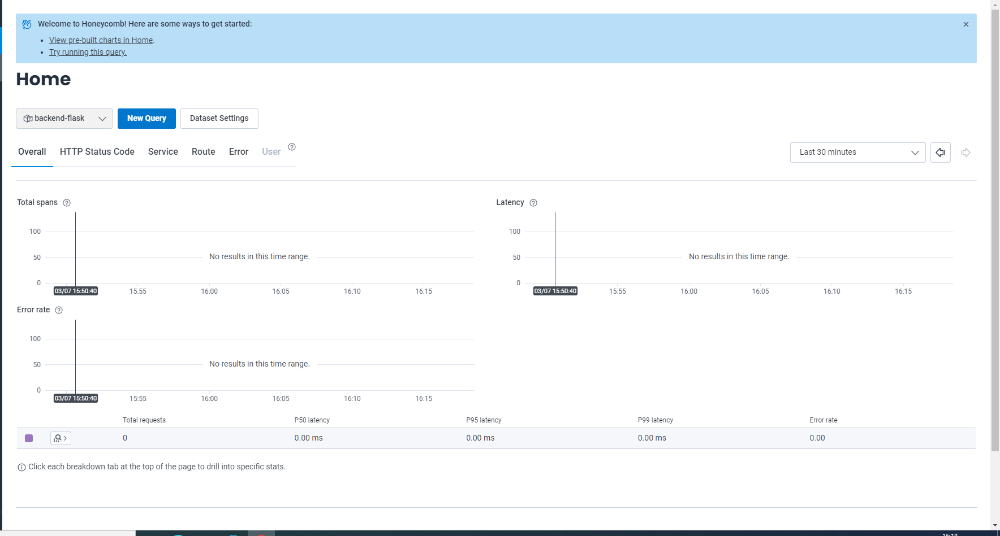
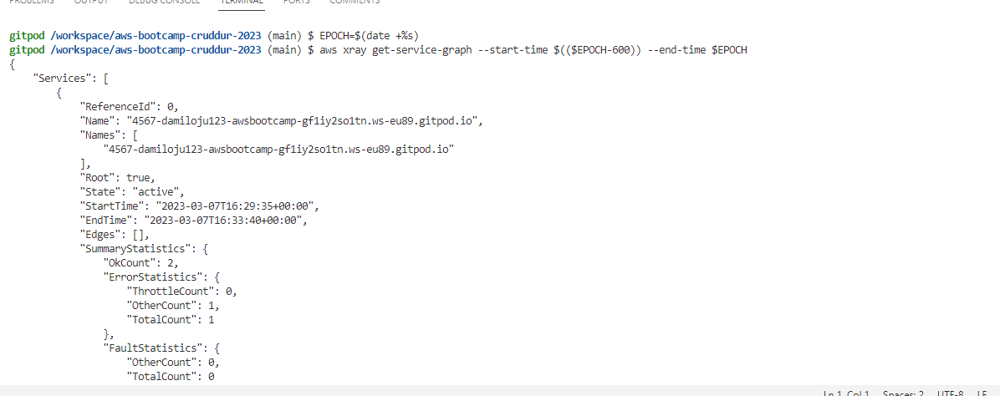
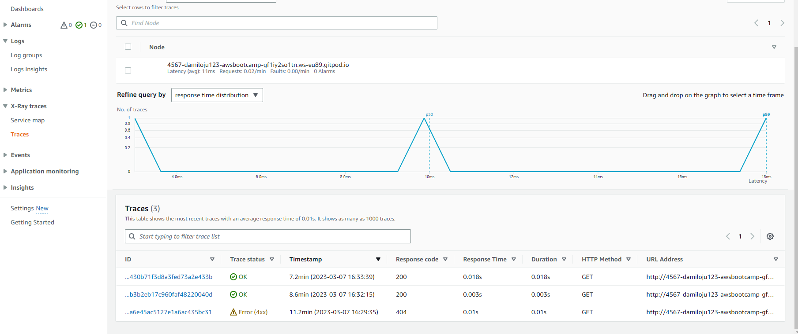
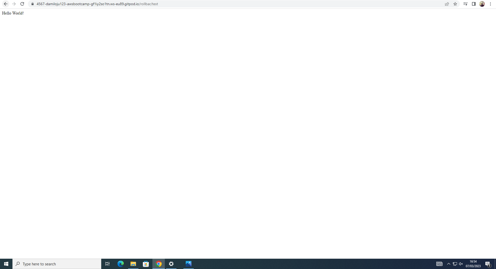
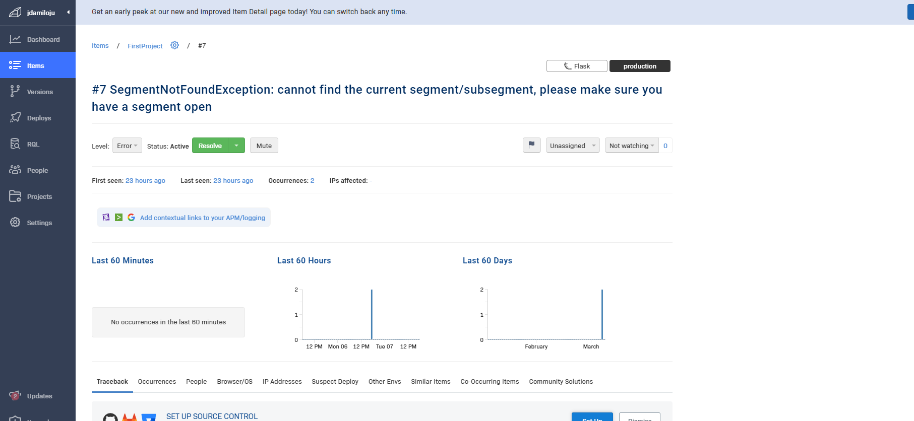

# Week 2 — Distributed Tracing

## Homework

| TASK | COMPLETED |
|  --- |    ---    |
| Watch Week 2 Live-Stream Video | :heavy_check_mark: |
| Watch Chirag Week 2 - Spending Considerations | :heavy_check_mark: |
| Watched Ashish's Week 2 - Observability Security Considerations | :heavy_check_mark: |
| Instrument Honeycomb with OTEL | :heavy_check_mark: |
| Instrument AWS X-Ray | :heavy_check_mark: |
| Instrument AWS X-Ray Subsegments | :heavy_check_mark: |
| Configure custom logger to send to CloudWatch Logs | :heavy_check_mark: |
| Integrate Rollbar and capture and error | :heavy_check_mark: |


I was able to achieve the below tasks in week 2.

- Instrumented the backend flask application to use Open Telemetry (OTEL) with Honeycomb.io as the provider
- 
|

- Ran queries to explore traces within Honeycomb.io
- X

- Instrumented AWS X-Ray into backend flask application

Added the below to the `requirements.txt`

```py
aws-xray-sdk
```
Installed python dependencies

```sh
pip install -r requirements.txt
```

Set Environment Variables
```sh
export AWS_REGION="us-east-1"
gp env AWS_REGION="us-east-1"
```

Added the below lines of code to `app.py`

```py
from aws_xray_sdk.core import xray_recorder
from aws_xray_sdk.ext.flask.middleware import XRayMiddleware

xray_url = os.getenv("AWS_XRAY_URL")
xray_recorder.configure(service='Cruddur', dynamic_naming=xray_url)
XRayMiddleware(app, xray_recorder)
```

### Setup AWS X-Ray Resources

Added these lines of code to `aws/json/xray.json`

```json
{
  "SamplingRule": {
      "RuleName": "Cruddur",
      "ResourceARN": "*",
      "Priority": 9000,
      "FixedRate": 0.1,
      "ReservoirSize": 5,
      "ServiceName": "Cruddur",
      "ServiceType": "*",
      "Host": "*",
      "HTTPMethod": "*",
      "URLPath": "*",
      "Version": 1
  }
}
```


- Configured and provision X-Ray daemon within docker-compose and send data back to X-Ray API

### Configured the AWS X-Ray Resources

```sh
FLASK_ADDRESS="https://4567-${GITPOD_WORKSPACE_ID}.${GITPOD_WORKSPACE_CLUSTER_HOST}"
aws xray create-group \
   --group-name "Cruddur" \
   --filter-expression "service(\"$FLASK_ADDRESS\") {fault OR error}"
```

### Created a sampling Rule
```sh
aws xray create-sampling-rule --cli-input-json file://aws/json/xray.json
```


### Set up X-ray Daemon

```sh
 wget https://s3.us-east-2.amazonaws.com/aws-xray-assets.us-east-2/xray-daemon/aws-xray-daemon-3.x.deb
 sudo dpkg -i **.deb
 ```

### Added Deamon Service to Docker Compose

```yml
  xray-daemon:
    image: "amazon/aws-xray-daemon"
    environment:
      AWS_ACCESS_KEY_ID: "${AWS_ACCESS_KEY_ID}"
      AWS_SECRET_ACCESS_KEY: "${AWS_SECRET_ACCESS_KEY}"
      AWS_REGION: "us-east-1"
    command:
      - "xray -o -b xray-daemon:2000"
    ports:
      - 2000:2000/udp
```

Added these two env vars to the backend-flask in our `docker-compose.yml` file

```yml
      AWS_XRAY_URL: "*4567-${GITPOD_WORKSPACE_ID}.${GITPOD_WORKSPACE_CLUSTER_HOST}*"
      AWS_XRAY_DAEMON_ADDRESS: "xray-daemon:2000"
```

### Tested service data for last 10 minutes

```sh
EPOCH=$(date +%s)
aws xray get-service-graph --start-time $(($EPOCH-600)) --end-time $EPOCH
```

### Output
|

- Observed X-Ray traces within the AWS Console
|

- Installed WatchTower and write a custom logger to send application log data to CloudWatch Log group


## CloudWatch Logs

Added the below to the `requirements.txt`

```
watchtower
```

Installed Watch Tower
```sh
pip install -r requirements.txt
```


Added the below lines of code to  `app.py`

```
import watchtower
import logging
from time import strftime
```

```py
# Configuring Logger to Use CloudWatch
LOGGER = logging.getLogger(__name__)
LOGGER.setLevel(logging.DEBUG)
console_handler = logging.StreamHandler()
cw_handler = watchtower.CloudWatchLogHandler(log_group='cruddur')
LOGGER.addHandler(console_handler)
LOGGER.addHandler(cw_handler)
LOGGER.info("some message")
```

```py
@app.after_request
def after_request(response):
    timestamp = strftime('[%Y-%b-%d %H:%M]')
    LOGGER.error('%s %s %s %s %s %s', timestamp, request.remote_addr, request.method, request.scheme, request.full_path, response.status)
    return response
```

Logged the below to an API endpoint
```py
LOGGER.info('Hello Cloudwatch! from  /api/activities/home')
```

Set the env var in your backend-flask for `docker-compose.yml`

```yml
      AWS_DEFAULT_REGION: "${AWS_DEFAULT_REGION}"
      AWS_ACCESS_KEY_ID: "${AWS_ACCESS_KEY_ID}"
      AWS_SECRET_ACCESS_KEY: "${AWS_SECRET_ACCESS_KEY}"
```

- Integrated Rollbar for Error Logging

Logged into https://rollbar.com/

Created a new project in Rollbar called `Cruddur`

Added the below to `requirements.txt`

```
blinker
rollbar
```

Installed the dependencies

```sh
pip install -r requirements.txt
```

Set access token

```sh
export ROLLBAR_ACCESS_TOKEN=""
gp env ROLLBAR_ACCESS_TOKEN=""
```

Added the access token to backend-flask for `docker-compose.yml`

```yml
ROLLBAR_ACCESS_TOKEN: "${ROLLBAR_ACCESS_TOKEN}"
```

Imported for Rollbar, Added the below to the app.py code

```py
import rollbar
import rollbar.contrib.flask
from flask import got_request_exception
```

```py
rollbar_access_token = os.getenv('ROLLBAR_ACCESS_TOKEN')
@app.before_first_request
def init_rollbar():
    """init rollbar module"""
    rollbar.init(
        # access token
        rollbar_access_token,
        # environment name
        'production',
        # server root directory, makes tracebacks prettier
        root=os.path.dirname(os.path.realpath(__file__)),
        # flask already sets up logging
        allow_logging_basic_config=False)

    # send exceptions from `app` to rollbar, using flask's signal system.
    got_request_exception.connect(rollbar.contrib.flask.report_exception, app)
```

Added an endpoint just for testing rollbar to `app.py`

```py
@app.route('/rollbar/test')
def rollbar_test():
    rollbar.report_message('Hello World!', 'warning')
    return "Hello World!"
```

Output

|

- Triggered an error an observe an error with Rollbar

|


